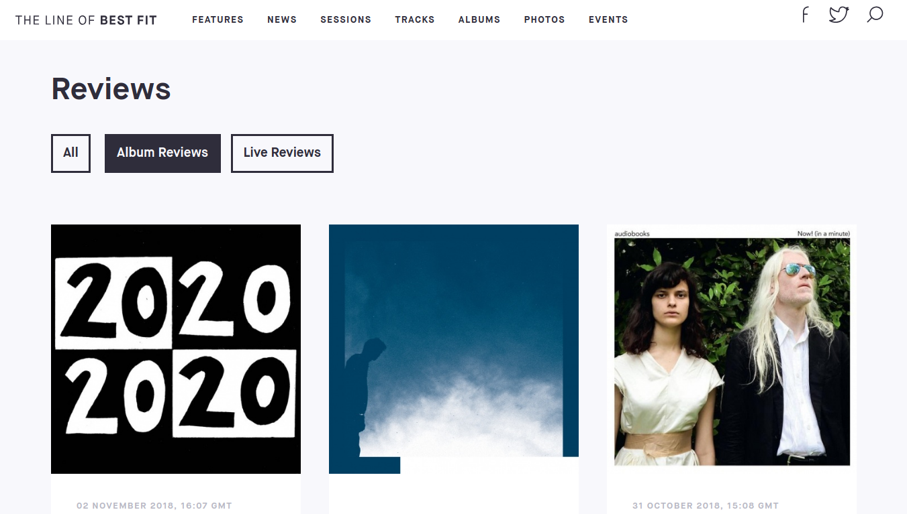

# scrapy-tlobf

Uses scrapy to scrape [The Line of Best Fit](https://www.thelineofbestfit.com) for album reviews.



## Usage

- [Install scrapy](https://doc.scrapy.org/en/latest/intro/install.html) for your os, usually:

  ```bash
  pip install Scrapy
  ```

- Clone and cd into repo:

  ```bash
  git clone https://github.com/aksh1618/scrapy-tlobf.git && cd scrapy-tlobf
  ```

- Run:

  ```bash
  scrapy crawl album_reviews -o album_reviews.json
  ```
